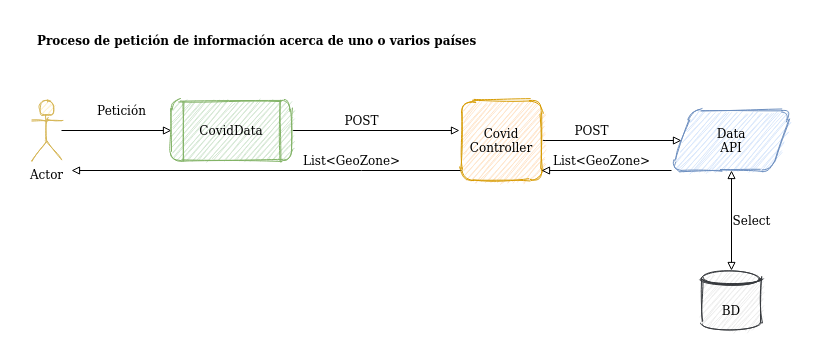

# Introducción

Siguiendo con la tendencia actual, especialmente dentro del marco de trabajo de .NET, de fraccionar las aplicaciones en diversos microservicios capaces de funcionar de manera independiente y de ser gestionados por una persona que será la responsable de uno o varios de los mismos, el conjunto total de esta aplicación ha sido dividido en tres aplicaciones. Dos de ellas tienen una funcionalidad independiente de las demás y atienden a la responsabilidad procedural de la aplicación, y una tercera que se emplea como marco de interacción con el usuario. 

La interacción con el usuario así como la coordinación de los diferentes procesos y funcionalidades que presenta esta aplicación le corresponde a esta API. 

# Responabilidades

1. Recepción de nuevas peticiones de registro de usuario y transmisión de las mismas a la API de Seguridad Security_API.

2. Entrega de clave pública única de usuario tras cada nuevo registro.

3. Transmisión de peticiones de autentificación a la API de seguridad y generación de token en caso de que el usuario haya ingresado correctamente sus datos de ingreso al sistema.

4. Autentificación token mediante de usuarios que realizan nuevas peticiones de información.

5. Transmisión de las peticiones de consulta llevadas a cabo por los usuarios hacia la API de gestión de datos DataAccess_API y de su respuesta en sentido inverso.

6. Generación y refresco de una memoria caché que permita el servicio de los datos acerca de la evolución de la pandemia de la totalidad de países disponibles, filtrados por rango de fechas, empleando para ello el menor tiempo posible.

# Tecnologías empleadas

    - SDK de .Net Core 3.1
    - ASP .Net Core 3.1
    - .Net Core 3.1
    - JSON
    - NewtonSoft
    - Draw.io

## Documentación Oficial

- **.Net Core**: https://docs.microsoft.com/es-es/dotnet/core/

- **JSON**: https://developer.mozilla.org/es/docs/Learn/JavaScript/Objects/JSON
- **Newtonsoft**: https://www.newtonsoft.com/json/help/html/Introduction.htm
- **Draw.io**: http://draw.io

# Puesta en Marcha

1. Instalar las cuatro primeras dependencias citadas en el apartado anterior.

2. Poner en marcha las dos APIs componentes: DataAccess_API y Security_API.

3. Inicializar.

4. Una vez inicializada, estará disponible desde:
    -  https://localhost:5001/api/covid para consultas.

    - https://localhost:5001/api/authorize para autentificaciones.

    - https://localhost:5001/api/user para nuevos usuarios.

5. Ver manual completo de usuario para conocer el proceso en profundidad.

# Modificar url

Dentro de la carpeta situada en Covid_API/Properties se encuentra el archivo launchProperties.json . En su interior se puede modificar la dirección y el puerto de acceso.

# Nuevo Usuario

# Autentificar Usuario

# Petición de Información

# Petición de Información para todos los países disponibles

