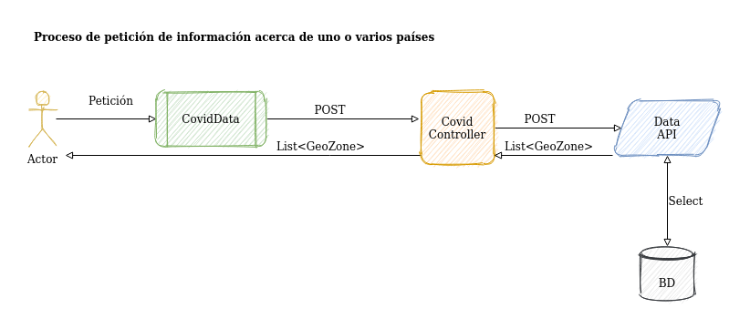

# Covid API

## Manual simple de usuario

# 1. Puesta en marcha

## 1.1 Instalando dependencias

Para que este API pueda funcionar son necesarias las siguientes dependencias:

- SDK de .Net Core 3.1

- ASP de .Net Core 3.1

- .Net Core 3.1

- PostgreSQL 11.8

Pueden seguirse los siguientes tutoriales:

- https://docs.microsoft.com/es-es/dotnet/core/install/linux

- https://www.postgresql.org/docs/11/installation.html

# 1.2 Arrancando la Aplicación

1. Iniciar aplicación [DataAccess_API](../../DataAccess_API/Documentation/ManualSimpleUsuario_DataAccess_API.md).

2. Iniciar aplicación [Security_API](../../Security_API/Documentation/ManualSimpleUsuario_Security_API.md).

# 1.3 Levantando la aplicación

1. Navegar hasta la ruta **APIs/Covid_API**.

2. Ejecutar el comando dotnet build desde la consola de comandos. Ref: https://docs.microsoft.com/es-es/dotnet/core/tools/dotnet-build

3. Ejecutar el comando dotnet run desde la consola de comandos. Ref: https://docs.microsoft.com/es-es/dotnet/core/tools/dotnet-run

4. Es posible sustituir los dos pasos anteriores por al arranque desde un IDE.

# 2. Usando la aplicación. La secuencia a seguir.

Se trata de una aplicación diseñada para actuar como gestora de los servicios que el conjunto de aplicaciones de las que está compuesta puede ofrecer. Además, mejora tanto el rendimiento en materia de acceso a datos al implementar una memoria caché que los sirve con mayor velocidad, como la facilidad de uso de la misma y la seguridad pues posibilita, mediante el empleo de los JWT token, la autentificación única  con una validez de veinticuatro horas.

Para acceder a la información serán necesarios unos pasos previos.

# 2.1 Registro de usuario

1. **Registrar un usuario.** El registro se efectuará realizando, primero, una petición **GET** a la url https://localhost:5001/api/user . Como respuesta se recibirá una clave pública con la que encriptar los datos de usuario.

2. **Enviar una petición  de nuevo usuario.** Con la clave pública recibida se deberán encriptar los campos (ejemplo de petición más abajo) de “email” y “pass”. Además, se deberá establecer el valor true en el campo “new”. La url a la que enviar el POST será la misma del paso anterior.

3. **Recepción y guardado de respuesta.** Como respuesta se recibirá una clave pública que será única para el usuario. Es responsabilidad del mismo su correcto almacenamiento pues, para futuras identificaciones, deberá enviarla en el correspondiente campo **“public_key”** junto con los campos **“email”** y **“pass”** encriptados con esa clave pública particular.

### Ejemplo de petición: 

<pre>
    <code>
{
"email": "xP9BAdai/dJDWZqAKaWjUWiSvK4U1I76xxkYcU2q+dFf2jtY8yN3MUXqGxCdmmyAPtw2lVnWQTPLlp8EbTunvRfgarWv3ZN5ztzWqH/jauEntwfiJNi5WLowkWsk2nfC/M6+7Pc5cJjcP7xOFUmKDojWaMNo2mZns/WeCjzUCbl3VrXZoWC5tguP+nG+/FuZu/1JapVcRapXA8Y6Fv3BhDk8MFg2ieSGShBbloantcXleOqxsLCVxr09elHjvvbCz6keGWBYdmmUVViSZvBgs8nzIwrUCa9prcyCp/MVLPCKd4/J0yj8rOFSP8b89wyo0oGwAObrZfy3Dj89Gh+E4IFnEF8A52GkSAM7qY6LISKkDyvN/vwI/S+N7EYPQx92s9eqB0uHYY9hA3Ut+pXx8ByaM5rcPlF284HvnApsHoymdIAry60BdD711L2ejv1cp/GnPoG3gpaeup8zmo60qPMTGXoYnLrUW9vweyiHqCJ01G5cFYxti+KMhIxfml9V",
"pass": "WqMti7Du5JldRjaP0rDTFA/GmzYrneQg6QUrmLoMtvB6/3U/Ego3qW/IIcKQ7CEmRwyTuirElwd1WIGqNojZ7bgcyZVy8mQciMEmSSF6l8IrYny4OXWSfcHpG6G+2FP/zQZrglckTc2Hx56dJc2IY6yJJDGduMakesBHqP/UDkpVZGBUwfOx13NTIXRTQgmCGb+Se3tyK7aI+0eIxDIyFZ+SCK8TJZXykSaVbPltoJ4R/9z4/LG8VhYIkmIb5FQfu9lgSwJd+NUca+7vr8eSuobsbG4rx0YJs0CF78TRFU8ZshNbMXgVfl2EiTQfCR3Gk5UBKKhdi551rPe2cL8JwX2jtJMc6ApD7Rh/xV/rWyPbplSRikI7gO4Y2zbSkUu6rsc1UHEc/MGHT65wUerzDtvocQaRii2LGrLNOFB1Li1YJLi3eD9jImqgNaCjJHtK6jntF3VVn2CwwU6ROSkEkm8wChuiARjxq3yAPLU+wS+riLoinNf7TlbqahTpsanF",
"new": true
}
    </code>
</pre>

## 2.2 Autentificar un usuario

1. Enviar petición **POST**. La url a la que realizar la petición es https://localhost:5001/api/authorize . En ella se han de incluir los campos **“email”** y **“pass”** encriptados con la clave pública única de usuario, dada como respuesta al registro de usuario. Además, se ha de incluir un campo con esta clave pública (**“public_key”**).

2. **Almacenar token de respuesta.**  Como respuesta, en caso de autentificación exitosa, se recibirá un **token** que deberá adjuntarse en la cabecera como autentificación para futuras peticiones de información. Dicho token poseerá una validez de **24 horas**, tras las cuales se deberá realizar el proceso de autentificación de nuevo.

### Ejemplo de petición:

<pre>
<code>
{
"email": "xP9BAdai/dJDWZqAKaWjUWiSvK4U1I76xxkYcU2q+dFf2jtY8yN3MUXqGxCdmmyAPtw2lVnWQTPLlp8EbTunvRfgarWv3ZN5ztzWqH/jauEntwfiJNi5WLowkWsk2nfC/M6+7Pc5cJjcP7xOFUmKDojWaMNo2mZns/WeCjzUCbl3VrXZoWC5tguP+nG+/FuZu/1JapVcRapXA8Y6Fv3BhDk8MFg2ieSGShBbloantcXleOqxsLCVxr09elHjvvbCz6keGWBYdmmUVViSZvBgs8nzIwrUCa9prcyCp/MVLPCKd4/J0yj8rOFSP8b89wyo0oGwAObrZfy3Dj89Gh+E4IFnEF8A52GkSAM7qY6LISKkDyvN/vwI/S+N7EYPQx92s9eqB0uHYY9hA3Ut+pXx8ByaM5rcPlF284HvnApsHoymdIAry60BdD711L2ejv1cp/GnPoG3gpaeup8zmo60qPMTGXoYnLrUW9vweyiHqCJ01G5cFYxti+KMhIxfml9V",
"pass": "WqMti7Du5JldRjaP0rDTFA/GmzYrneQg6QUrmLoMtvB6/3U/Ego3qW/IIcKQ7CEmRwyTuirElwd1WIGqNojZ7bgcyZVy8mQciMEmSSF6l8IrYny4OXWSfcHpG6G+2FP/zQZrglckTc2Hx56dJc2IY6yJJDGduMakesBHqP/UDkpVZGBUwfOx13NTIXRTQgmCGb+Se3tyK7aI+0eIxDIyFZ+SCK8TJZXykSaVbPltoJ4R/9z4/LG8VhYIkmIb5FQfu9lgSwJd+NUca+7vr8eSuobsbG4rx0YJs0CF78TRFU8ZshNbMXgVfl2EiTQfCR3Gk5UBKKhdi551rPe2cL8JwX2jtJMc6ApD7Rh/xV/rWyPbplSRikI7gO4Y2zbSkUu6rsc1UHEc/MGHT65wUerzDtvocQaRii2LGrLNOFB1Li1YJLi3eD9jImqgNaCjJHtK6jntF3VVn2CwwU6ROSkEkm8wChuiARjxq3yAPLU+wS+riLoinNf7TlbqahTpsanF",
"new": false,

"public_key" : "<RSAKeyValue><Modulus>nlFoRNsY4J2Bfvg/5e8NHocLCLkLbrWte/JnBCnbT2hn1Zh3s/mOHv6SCh1UmaXZ9b5Ey0/hKibOU1xwSb6m8l1VSAdaz63tU0ayfrg1mFLwi2vW8MIDpR6yJLO+HHUpyRW7UTJ/WFNmPLckRUTxdekl3XAwqrZ+fMcpNqavD8rKG62x3gUetngrZXSeC5O732d4IoTQb4inTPDoCT+QW2rg1CLlhic+WRPyp/T97CAKeCLnuzLfUKVx574/WQ0BGFxPn4oOdfMmm5EbsJpzcqMge0u6YARasSzjbC2MlErP9VcrhTAlQdyidiSxNuyJxInIyVt15XMDO/D/h7WgfkXh4F6aunRsseXSMRiLSoVn/45/nr5+dxC+V7Eb16ZeL3MYOg2BvetsNMyLEfVGhVU+zhZE76G1yQTkGfGV2gQca/wjJLphCvKE9SewW1GhHFuwrBN6e7SzXV8GSZhCE0VNgpcbe/IoW2LX414Q4xaNFRwyrV6FtXWbbSVkNniF</Modulus><Exponent>AQAB</Exponent></RSAKeyValue>"
}
    </code>
</pre>

## 2.3 Petición de datos

Una vez obtenido el token se pueden realizar tantas peticiones de información como se desee. La petición **POST** a efectuar puede sufrir diferentes modificaciones con el objetivo de obtener distintas respuestas. Además, posee dos métodos adicionales que generarán un conjunto de datos de respuesta diferente. La petición sería la siguiente:

<pre>
    <code>
{
	"covid_data":
	{
	"countries":
	[
	"ES",
	"AD",
	"AE"

	],
	"dates":
	{
		"startDate": "31/12/2019",
		"endDate": "28/07/2020",
		"separator": "/"
	},

		"dataType": "any"
	}
}
    </code>
</pre>

- El elemento **“countries”** puede contener un único código **ISO2** de país o tantos como se desee. Es posible emplear el comodín **“*”** para obtener la información relativa a todos los países disponibles en base de datos.

- El elemento **“separator”** de **“dates”** es modificable y se puede usar el que se desee. Sin embargo, el formato de fecha deberá ser siempre el mismo.

- Como extra, **“dataType”** se puede emplear para obtener una lista con todos los países disponibles (**getcountries**) o, una con todas la fechas válidas para consulta (**getdates**). Éste método invalidará todos los demás.

# 3. Respuestas

## 3.1 Datos

<pre>
    <code>
[
    {
        "father": null,
        "sonList": null,
        "geoID": "ES",
        "code": "ESP",
        "name": "Spain",
        "population": 46723749,
        "dataList": [
            {
                "id": 2,
                "cases": 0,
                "deaths": 0,
                "cured": 0,
                "date": {
                    "id": 2,
                    "date": "01/01/2020",
                    "dateSeparator": "/",
                    "dateFormat": "dd/MM/yyyy"
                }
            },
            {
                "id": 1,
                "cases": 0,
                "deaths": 0,
                "cured": 0,
                "date": {
                    "id": 1,
                    "date": "31/12/2019",
                    "dateSeparator": "/",
                    "dateFormat": "dd/MM/yyyy"
                }
            }
        ]
    }
]
    </code>
</pre>

## 3.2 Países

<pre>
    <code>
[
    {
        "father": null,
        "sonList": null,
        "geoID": "AD",
        "code": "AND",
        "name": "Andorra",
        "population": 77006,
        "dataList": null
    },
    {
        "father": null,
        "sonList": null,
        "geoID": "AE",
        "code": "ARE",
        "name": "United_Arab_Emirates",
        "population": 9630959,
        "dataList": null
    },..
]
    </code>
</pre>

## 3.3 Fechas
<pre>
    <code>
[
    {
        "id": 1,
        "date": "31/12/2019",
        "dateSeparator": "/",
        "dateFormat": "dd/MM/yyyy"
    },
    {
        "id": 2,
        "date": "01/01/2020",
        "dateSeparator": "/",
        "dateFormat": "dd/MM/yyyy"
    },..
]
    </code>
</pre>

# 4. Flujo simple de aplicación

