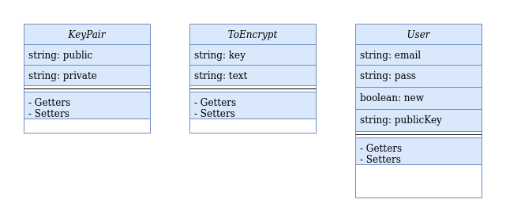

# Security API

# Manual simple de usuario

# 1. Puesta en marcha

## 1.1 Instalando dependencias

Para que este API pueda funcionar son necesarias las siguientes dependencias:

- SDK de .Net Core 3.1

- ASP de .Net Core 3.1

- .Net Core 3.1

- PostgreSQL 11.8

Pueden seguirse los siguientes tutoriales:

- https://docs.microsoft.com/es-es/dotnet/core/install/linux

- https://www.postgresql.org/docs/11/installation.html

# 1.2 Arrancando la API

1. El primer paso será la configuración de una base de datos sobre la cual realizar la persistencia y consulta de la información referente a los nuevos usuarios. Desde la página oficial de PostgreSQL puede consultarse una guía completa: https://www.postgresql.org/docs/11 .

2. Una vez generada una base de datos, será necesario configurar el programa para que acceda a la misma. Para ello se ha generado un archivo .json en el cual es posible introducir las credenciales y url de la base de datos. La API se encargará de gestionar esa información tras el primer arranque sin que el usuario tenga que realizar ninguna tarea adicional.

    La ruta al archivo es **/APIs/Secutiry_API/DAOs/Connection/connectionProperties.json**. Se trata de sustituir la información de cada campo por la generada en el paso anterior:

<pre>
<code>
{
    "server": "introducir url",
    "port": "introducir puerto",
    "userId": "introducir usuario",
    "pass": "introducir contraseña",
    "dataBase": "introducir base de datos"
}
</code>
</pre>

# 1.3 Levantando la aplicación

1. Navegar hasta la ruta **APIs/Security_API**.

2. Ejecutar el comando dotnet build desde la consola de comandos. Ref: https://docs.microsoft.com/es-es/dotnet/core/tools/dotnet-build

3. Ejecutar el comando dotnet run desde la consola de comandos. Ref: https://docs.microsoft.com/es-es/dotnet/core/tools/dotnet-run

4. Es posible sustituir los dos pasos anteriores por al arranque desde un IDE.

5. Esperar varios minutos. La aplicación generará todas las bases de datos necesarias para su empleo e insertará todos los datos necesarios. Si tras varios minutos no se observase la creación de ninguna tabla en base de datos se recomienda detener la aplicación y comprobar la conexión al servidor de base de datos.

# 2. Usando la aplicación. Los métodos.

La aplicación se encuentra configurada para atender peticiones **GET** y **POST** enviadas a la url https://localhost:5003/Security . Si desea cambiarse el puerto de acceso es posible modificando el archivo  **APIs/Seurity_API/Properties/launchProperties.json**.

**Nota:** Todas las encriptaciones serán sometidas a una conversión posterior a **Base64**. Desde la misma se volverá a generar el código binario que será desencriptado posteriormente.

# 2.1 Get

Está pensado para eliminar la necesidad de exponer los datos sensibles del usuario. Antes de dar de alta un nuevo usuario se solicitará, mediante éste método una clave pública con la que encriptar los datos. Una respuesta de ejemplo será, simplemente, la que sigue:

**&lt;RSAKeyValue>&lt;Modulus>nlFoRNsY4J2Bfvg/5e8NHocLCLkLbrWte/JnBCnbT2hn1Zh3s/mOHv6SCh1UmaXZ9b5Ey0/hKibOU1xwSb6m8l1VSAdaz63tU0ayfrg1mFLwi2vW8MIDpR6yJLO+HHUpyRW7UTJ/WFNmPLckRUTxdekl3XAwqrZ+fMcpNqavD8rKG62x3gUetngrZXSeC5O732d4IoTQb4inTPDoCT+QW2rg1CLlhic+WRPyp/T97CAKeCLnuzLfUKVx574/WQ0BGFxPn4oOdfMmm5EbsJpzcqMge0u6YARasSzjbC2MlErP9VcrhTAlQdyidiSxNuyJxInIyVt15XMDO/D/h7WgfkXh4F6aunRsseXSMRiLSoVn/45/nr5+dxC+V7Eb16ZeL3MYOg2BvetsNMyLEfVGhVU+zhZE76G1yQTkGfGV2gQca/wjJLphCvKE9SewW1GhHFuwrBN6e7SzXV8GSZhCE0VNgpcbe/IoW2LX414Q4xaNFRwyrV6FtXWbbSVkNniF&lt;/Modulus>&lt;Exponent>AQAB&lt;/Exponent>&lt;/RSAKeyValue>**

# 2.2 Nuevo Usuario

Se efectúa una única vez y sirve para dar de alta a un nuevo usuario en el sistema. Éste usuario recibirá una **pareja de clave pública y privada únicas** e intrasferibles para él. Su contraseña será almacenada en base de datos **encriptada** con su propia **clave privada** y, a su vez, su clave privada se almacenará, junto a la pública, encriptada mediante una **clave pública propia** de la aplicación que se irá **modificando cada 100 usos** de la misma. Esto quiere decir que una buena parte de la base de datos será actualizada cada cierto tiempo para salvaguardar la información crítica del usuario.

Un ejemplo de petición sería la siguiente:

<pre>
<code>
{
"email": "PIwpNi5y3S3g37JXpBfWUF9mhKo2mQHWOmy79HFnLb6BvGSy8S1ayXQaKctaQsBXvDBYJzUizhBQKcHQJGyx+X6rQrzTBlvTAFIlOPznAlPqL3xGayFdJ1mBsNg2clpXFhZs5D9iuKWhJcej+aYbDPYR3hyEmrRchfXALrHxKGsIhlhyWOQpIMqjx9DeOydmXzNiuGJMn1mZahOQkEmZcBuv3Rra0r2aY2nWH2KxiFZoOSu+ZJiRh++QqfjVG5IIrGX9r5V7asB9BWF8U862tqP4UUhYzuvEEM13WaqHMB8H6a3cKqlzoUL+jIfnf5vYI7Mdr+MwiboXsK4PGD4Qd61NMQWPv9ZVeMtopjpUzDWDBx6n1cF2vv0BngMoU1o8yOG/2m1Oug8SqfqsiDasY0h9vWp+bmsH3zrFjDcmg3X8sIA+o45PhnaVBjUqmlVid04j5t+QbXUru8B57ZBGkoU94dWXzeTSEZ6Qrr1aPNFfEfpiwhL9OVIe5aF1k0cg",
"pass": "iLqLoAOSx2oecCirygpc9UcCrJCdWTlnHc2+piYLxY/YnfmU5hTOrpai9A/8aoFR2WUbaBv+cUpJmLKfLy6/UBnuuusLtm+BMKP1dkZwxLaxFe1Dyj7NGd/yCYiKM/8Wp4GYe6zShc5s0WBOuT6Hn7dJtrRyU8igRNfWENJkdig67KiUvIvnSAzb6CWbwu4l13B66zStAsJU47FM4yWbUcFQmQ8ffS5tBtN62qQdHFzX+AAefFk+ObEJMHyc1ajeSHzCJSkwOvyF0rWH1WbkfSF9eXjuzcRTs95mKHOfFJPrMnF/+pTjzyNHD9tZJQkCKydXYLU8Z/qytJ3USev73KvBO/9L9he1tA8Re3gABqkQ7lKB2UZKOgHh5UNT9IsBgVHxe2GM0rb124DiOGY8IyeMD2L/1UDVvm86l+rAkPX3hWtWd5ePqEG1mRY0Hiuf3nv9h98gTd+reYg1EGy4S9qjKVCZVAur/e7af9pdgNWGxa/jVoc2gv+5RsvnL6uk",
"new": true,
}
</code>
</pre>

Con el elemento **“new”**  se indica que se pretende dar de alta a un usuario nuevo.
Una respuesta con la clave pública única de usuario, que éste deberá de almacenar es generada:

**&lt;RSAKeyValue>&lt;Modulus>nlFoRNsY4J2Bfvg/5e8NHocLCLkLbrWte/JnBCnbT2hn1Zh3s/mOHv6SCh1UmaXZ9b5Ey0/hKibOU1xwSb6m8l1VSAdaz63tU0ayfrg1mFLwi2vW8MIDpR6yJLO+HHUpyRW7UTJ/WFNmPLckRUTxdekl3XAwqrZ+fMcpNqavD8rKG62x3gUetngrZXSeC5O732d4IoTQb4inTPDoCT+QW2rg1CLlhic+WRPyp/T97CAKeCLnuzLfUKVx574/WQ0BGFxPn4oOdfMmm5EbsJpzcqMge0u6YARasSzjbC2MlErP9VcrhTAlQdyidiSxNuyJxInIyVt15XMDO/D/h7WgfkXh4F6aunRsseXSMRiLSoVn/45/nr5+dxC+V7Eb16ZeL3MYOg2BvetsNMyLEfVGhVU+zhZE76G1yQTkGfGV2gQca/wjJLphCvKE9SewW1GhHFuwrBN6e7SzXV8GSZhCE0VNgpcbe/IoW2LX414Q4xaNFRwyrV6FtXWbbSVkNniF&lt;/Modulus>&lt;Exponent>AQAB&lt;/Exponent>&lt;/RSAKeyValue>**

# 2.3 Autentificar

Con éste método se comprueba si el usuario ha sido registrado previamente en base de datos y si los datos transmitidos son correctos. Como la petición anterior, se compone de los elementos **“email”** y **“pass”**, pero en esta ocasión deben de haber sido encriptados con la clave pública única para el usuario que será remitida dentro del elemento **“public_key”**.

Una petición de ejemplo es la que sigue:

<pre>
<code>
{
"email": "PIwpNi5y3S3g37JXpBfWUF9mhKo2mQHWOmy79HFnLb6BvGSy8S1ayXQaKctaQsBXvDBYJzUizhBQKcHQJGyx+X6rQrzTBlvTAFIlOPznAlPqL3xGayFdJ1mBsNg2clpXFhZs5D9iuKWhJcej+aYbDPYR3hyEmrRchfXALrHxKGsIhlhyWOQpIMqjx9DeOydmXzNiuGJMn1mZahOQkEmZcBuv3Rra0r2aY2nWH2KxiFZoOSu+ZJiRh++QqfjVG5IIrGX9r5V7asB9BWF8U862tqP4UUhYzuvEEM13WaqHMB8H6a3cKqlzoUL+jIfnf5vYI7Mdr+MwiboXsK4PGD4Qd61NMQWPv9ZVeMtopjpUzDWDBx6n1cF2vv0BngMoU1o8yOG/2m1Oug8SqfqsiDasY0h9vWp+bmsH3zrFjDcmg3X8sIA+o45PhnaVBjUqmlVid04j5t+QbXUru8B57ZBGkoU94dWXzeTSEZ6Qrr1aPNFfEfpiwhL9OVIe5aF1k0cg",
"pass": "iLqLoAOSx2oecCirygpc9UcCrJCdWTlnHc2+piYLxY/YnfmU5hTOrpai9A/8aoFR2WUbaBv+cUpJmLKfLy6/UBnuuusLtm+BMKP1dkZwxLaxFe1Dyj7NGd/yCYiKM/8Wp4GYe6zShc5s0WBOuT6Hn7dJtrRyU8igRNfWENJkdig67KiUvIvnSAzb6CWbwu4l13B66zStAsJU47FM4yWbUcFQmQ8ffS5tBtN62qQdHFzX+AAefFk+ObEJMHyc1ajeSHzCJSkwOvyF0rWH1WbkfSF9eXjuzcRTs95mKHOfFJPrMnF/+pTjzyNHD9tZJQkCKydXYLU8Z/qytJ3USev73KvBO/9L9he1tA8Re3gABqkQ7lKB2UZKOgHh5UNT9IsBgVHxe2GM0rb124DiOGY8IyeMD2L/1UDVvm86l+rAkPX3hWtWd5ePqEG1mRY0Hiuf3nv9h98gTd+reYg1EGy4S9qjKVCZVAur/e7af9pdgNWGxa/jVoc2gv+5RsvnL6uk",
"new": false,

"public_key" : "&lt;RSAKeyValue>&lt;Modulus>nlFoRNsY4J2Bfvg/5e8NHocLCLkLbrWte/JnBCnbT2hn1Zh3s/mOHv6SCh1UmaXZ9b5Ey0/hKibOU1xwSb6m8l1VSAdaz63tU0ayfrg1mFLwi2vW8MIDpR6yJLO+HHUpyRW7UTJ/WFNmPLckRUTxdekl3XAwqrZ+fMcpNqavD8rKG62x3gUetngrZXSeC5O732d4IoTQb4inTPDoCT+QW2rg1CLlhic+WRPyp/T97CAKeCLnuzLfUKVx574/WQ0BGFxPn4oOdfMmm5EbsJpzcqMge0u6YARasSzjbC2MlErP9VcrhTAlQdyidiSxNuyJxInIyVt15XMDO/D/h7WgfkXh4F6aunRsseXSMRiLSoVn/45/nr5+dxC+V7Eb16ZeL3MYOg2BvetsNMyLEfVGhVU+zhZE76G1yQTkGfGV2gQca/wjJLphCvKE9SewW1GhHFuwrBN6e7SzXV8GSZhCE0VNgpcbe/IoW2LX414Q4xaNFRwyrV6FtXWbbSVkNniF&lt;/Modulus>&lt;Exponent>AQAB&lt;/Exponent>&lt;/RSAKeyValue>"
}
</code>
</pre>

# 2.4 Método Adicional. Encriptar texto.

Para facilitarle las cosas tanto al desarrollador como al posible usuario se ha habilitado un servicio extra que permite la recepción de un texto a encriptar y una clave pública a emplear y devuelve el texto encriptado y posteriormente trasladado a **Base64**. Está disponible desde la url https://localhost:5003/EncryptationService/ y permite la recepción de peticiones como la siguiente:

<pre>
<code>
{
"key":
 "&lt;RSAKeyValue>&lt;Modulus>nlFoRNsY4J2Bfvg/5e8NHocLCLkLbrWte/JnBCnbT2hn1Zh3s/mOHv6SCh1UmaXZ9b5Ey0/hKibOU1xwSb6m8l1VSAdaz63tU0ayfrg1mFLwi2vW8MIDpR6yJLO+HHUpyRW7UTJ/WFNmPLckRUTxdekl3XAwqrZ+fMcpNqavD8rKG62x3gUetngrZXSeC5O732d4IoTQb4inTPDoCT+QW2rg1CLlhic+WRPyp/T97CAKeCLnuzLfUKVx574/WQ0BGFxPn4oOdfMmm5EbsJpzcqMge0u6YARasSzjbC2MlErP9VcrhTAlQdyidiSxNuyJxInIyVt15XMDO/D/h7WgfkXh4F6aunRsseXSMRiLSoVn/45/nr5+dxC+V7Eb16ZeL3MYOg2BvetsNMyLEfVGhVU+zhZE76G1yQTkGfGV2gQca/wjJLphCvKE9SewW1GhHFuwrBN6e7SzXV8GSZhCE0VNgpcbe/IoW2LX414Q4xaNFRwyrV6FtXWbbSVkNniF&lt;/Modulus>&lt;Exponent>AQAB&lt;/Exponent>&lt;/RSAKeyValue>",

"text": "miuser"
}

</code>
</pre>
	
La respuesta sería la siguiente:

**xP9BAdai/dJDWZqAKaWjUWiSvK4U1I76xxkYcU2q+dFf2jtY8yN3MUXqGxCdmmyAPtw2lVnWQTPLlp8EbTunvRfgarWv3ZN5ztzWqH/jauEntwfiJNi5WLowkWsk2nfC/M6+7Pc5cJjcP7xOFUmKDojWaMNo2mZns/WeCjzUCbl3VrXZoWC5tguP+nG+/FuZu/1JapVcRapXA8Y6Fv3BhDk8MFg2ieSGShBbloantcXleOqxsLCVxr09elHjvvbCz6keGWBYdmmUVViSZvBgs8nzIwrUCa9prcyCp/MVLPCKd4/J0yj8rOFSP8b89wyo0oGwAObrZfy3Dj89Gh+E4IFnEF8A52GkSAM7qY6LISKkDyvN/vwI/S+N7EYPQx92s9eqB0uHYY9hA3Ut+pXx8ByaM5rcPlF284HvnApsHoymdIAry60BdD711L2ejv1cp/GnPoG3gpaeup8zmo60qPMTGXoYnLrUW9vweyiHqCJ01G5cFYxti+KMhIxfml9V**
	

           
# 3. El modelo de datos

           

